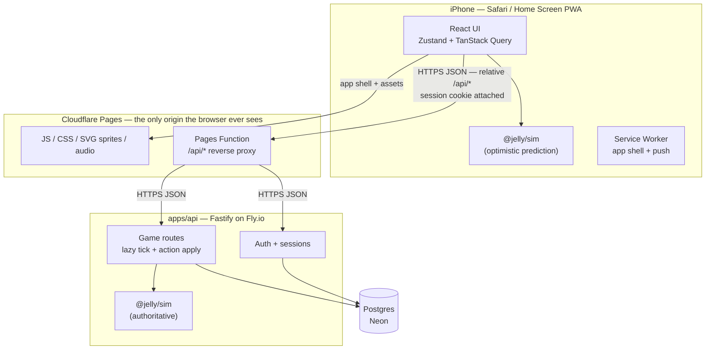

# Jellybean Simulator — Implementation Design

A technical design document for building **Jelly Bean Simulator** as a mobile web app.

`CONCEPT.md` is the source of game truth: what the game *is*. This document is the source
of build truth: how it gets made. Every game system below cross-references its
`CONCEPT.md` section (written `[C§5]`), and every number that `CONCEPT.md` left open is
pinned down here.

Three kinds of statement appear in this document, and the distinction is load-bearing:

- **Canon** — established by `TRANSCRIPT.md`. Not negotiable.
- **Extrapolated** — invented by `CONCEPT.md` to fill a gap. Marked ✳.
- **Implementation decision** — invented here, because code cannot be ambiguous.
  Marked **⚙**. These are the ones to argue with.

---

## Table of Contents

1. [Purpose & Scope](#1-purpose--scope)
2. [Goals, Non-Goals, Target Device](#2-goals-non-goals-target-device)
3. [System Architecture](#3-system-architecture)
4. [The Simulation Core](#4-the-simulation-core)
5. [Game System Specs](#5-game-system-specs)
6. [Resolved Open Questions](#6-resolved-open-questions)
7. [Data Model](#7-data-model)
8. [API Reference](#8-api-reference)
9. [Authentication & Security](#9-authentication--security)
10. [Frontend Architecture](#10-frontend-architecture)
11. [iPhone & PWA Specifics](#11-iphone--pwa-specifics)
12. [Push Notifications (deferred)](#12-push-notifications-deferred)
13. [Testing Strategy](#13-testing-strategy)
14. [Deployment & Operations](#14-deployment--operations)
15. [Build Phases](#15-build-phases)
16. [Risks & Future Work](#16-risks--future-work)
- [Appendix A: Canon Glossary → Mechanics](#appendix-a-canon-glossary--mechanics)
- [Appendix B: Coverage Checklist](#appendix-b-coverage-checklist)

---

## 1. Purpose & Scope

**Deliverable:** a web app, playable in Safari on an iPhone, in which a player registers
with a username and password, is granted a plot of land by Dr. Bubblegum, and raises a
Jelly Bean through its life cycle — with progress persisted server-side so it survives
closing the tab, changing devices, and the two weeks the player doesn't open it.

**In scope:** all seventeen systems in `CONCEPT.md` §1–17, a multi-tenant backend with
username/password auth, and a build order that produces something playable at the end of
every phase.

**Out of scope:** native iOS/Android apps, the PC build mentioned in `[C§1]`, real-money
payment processing (the store is designed but stubbed), voice acting, and the multi-device
time-zone flavor unlock `[C§6]` (designed in §16, not built).

---

## 2. Goals, Non-Goals, Target Device

### Product goals

1. **The micro-session is the unit of design.** `[C§17]` The player opens the app "just
   to check," and every core interaction — resolve a need, check the garden, play a
   mini-game — must complete in **under 60 seconds** from cold app open, one-handed, in
   portrait.
2. **Offline decay is exact.** `[C§5, C§17]` A Jelly Bean left for 14 hours must be in
   precisely the state the rules say, computed from the server clock, whether the player
   returns on their phone, their laptop, or three devices at once.
3. **The hole trap must actually work.** `[C§5, C§9]` Digging holes makes the Jelly Bean
   angrier, and **nothing in the UI ever links the two**. This is a real mechanic with a
   real hidden penalty, not a joke in a doc. It is a Phase 1 requirement.
4. **The barks are the interface.** `[C§5, C§14]` The player should know what their Jelly
   Bean needs from audio alone.

### Non-goals

- Competitive play, PvP, leaderboards beyond the canon "what level are you on?" `[C§15]`
- Real-time multiplayer. Friend interactions are asynchronous.
- Playing offline. The server is authoritative; offline shows a waiting screen (§10.5).
- Frame-rate-competitive graphics. This is an idle sim on a phone in a pocket.

### Target device envelope ⚙

| Axis | Target |
|---|---|
| Primary | iPhone SE (2nd gen) through iPhone 16 Pro Max, Safari 16.4+ |
| Orientation | Portrait only, one-handed, thumb-reachable bottom third |
| Secondary | Android Chrome 110+, desktop browsers (unstyled-for, not broken) |
| Viewport floor | 375 × 667 CSS px |
| Budget | < 250 KB JS gzipped initial, < 2.5 s time-to-interactive on 4G |
| Battery | Idle island scene < 5 % CPU; no rAF loop when the tab is hidden |

Safari 16.4 is the floor because it is the first version with Web Push for
home-screen-installed PWAs (§12).

---

## 3. System Architecture



The client never addresses the Fly app directly, and that hop through Pages is not
incidental plumbing: `SameSite=Lax` session cookies (§9.2) are only sent to the origin that
set them, so a browser talking straight to `*.fly.dev` would be permanently signed out.
§14 has the full reasoning.

### Repo layout

```
jelly-sim/
├── CONCEPT.md              game design canon
├── TRANSCRIPT.md           the source
├── DESIGN.md               this document
├── package.json            pnpm workspace root
├── packages/
│   ├── sim/                @jelly/sim — pure rules, zero I/O
│   │   ├── src/
│   │   │   ├── state.ts        BeanState, PlayerState types
│   │   │   ├── content.ts      all balance tables (§5)
│   │   │   ├── advance.ts      time-stepping
│   │   │   ├── actions.ts      action validation + application
│   │   │   ├── combat.ts       seeded encounter resolution
│   │   │   ├── rng.ts          seeded PRNG
│   │   │   └── index.ts
│   │   └── test/
│   └── shared/             @jelly/shared — API types, zod schemas
├── apps/
│   ├── api/                Fastify + Drizzle
│   │   ├── src/routes/     auth, state, actions, social, store
│   │   ├── src/db/         schema.ts, migrations/
│   │   └── test/
│   └── web/                Vite + React PWA
│       ├── src/screens/    Island, Farm, Games, Quests, Friends, ...
│       ├── src/render/     isometric renderer (swappable)
│       ├── src/audio/      bark playback
│       └── public/         manifest.webmanifest, sprites, sfx
└── .github/workflows/ci.yml
```

### Why this shape ⚙

**The simulation core is a separate package because it is the entire game.** Every rule
in §5 — decay curves, crop timers, the hole penalty, combat — lives in `@jelly/sim` and
nowhere else. It has no database, no HTTP, no `Date.now()`, and no DOM. Consequences:

- The rules are unit-testable in milliseconds. "14 hours pass, Jelly Bean is hungry" is a
  three-line test, not an integration suite.
- The client and server run **the same code**, so optimistic UI never disagrees with the
  server about anything except timing.
- Balance changes are one file (`content.ts`) and a version bump.

**The server is authoritative.** The client predicts; the server decides. Every response
carries the canonical state, and the client replaces its local copy with it. There is no
merge logic and no "client wins" path.

---

## 4. The Simulation Core

### 4.1 Contract

```ts
// packages/sim/src/index.ts

/** Fast-forward state to `toMs`. Pure, deterministic, idempotent under composition:
 *  advance(advance(s,m),b) === advance(s,b), for any m. */
export function advance(state: PlayerState, toMs: number): { state: PlayerState; events: SimEvent[] };

/** Attempt one player intent at a given instant. Never throws; returns a tagged result. */
export function apply(
  state: PlayerState,
  action: Action,
  atMs: number,
): { ok: true; state: PlayerState; events: SimEvent[] }
 | { ok: false; code: RejectCode; message: string };

/** Derived, never stored: what the UI reads. */
export function project(state: PlayerState, atMs: number): ProjectedView;

export const SIM_VERSION = 2;
```

**⚙ Revised in Phase 1: `advance` takes two arguments, not three.** The original signature
was `advance(state, fromMs, toMs)`. The start instant cannot be a parameter: ticks are
whole and the sub-minute remainder is carried (§4.3), and honouring a caller-supplied
`fromMs` is precisely what would discard that remainder and break composition at a split
point that is not on a minute boundary. The save's own `worldMs` is the only value that can
be trusted to say what has already been simulated. A parameter that must be ignored to stay
correct is better not taken.

### 4.2 Determinism rules ⚙

These are hard constraints on `packages/sim`, enforced by lint rule and code review:

1. **No ambient time.** `Date.now()`, `performance.now()`, and `new Date()` are banned.
   Time only ever arrives as a parameter.
2. **No ambient randomness.** `Math.random()` is banned. All randomness comes from a
   seeded PRNG (`xoshiro128**`) whose 4-word state is carried in `PlayerState.rng` and
   advanced by use. Given the same state and inputs, the same outcomes — on client and
   server both.
3. **No I/O.** No `fetch`, no `fs`, no imports outside `@jelly/shared`.
4. **Integer money.** All currency and XP are integers. No floats touch a balance.
5. **Clamp at the edges.** Meters clamp to `[0, 100]` after every mutation.

### 4.3 Time stepping ⚙

`advance` steps in **fixed 60-second sim minutes**, not one continuous integration. Fixed
steps make the result independent of how the interval is chopped up, which is what makes
multi-device play consistent.

A returning player who was gone 14 hours needs 840 steps — a fraction of a millisecond.
Long absences are capped: **any gap over 30 days is clamped to 30 days**, so an
abandoned save costs bounded work when it wakes up, and a player returning after a year
finds a very hungry Jelly Bean rather than a timeout.

⚙ **Whole ticks only, and the remainder is carried.** `advance` consumes
`floor((toMs − worldMs) / 60_000)` steps and leaves the sub-minute remainder unconsumed
rather than rounding it away. This is what makes the composition property in §13.1 exact
for an *arbitrary* split point rather than only for ones that happen to land on a minute
boundary, and multi-device play is exactly the case where the split point is one nobody
chose. Time never runs backwards: a client whose clock is behind the server's gets a no-op.

Per step, in order:

1. Advance world clock; recompute day phase and weather (§5.9).
2. Decay `hunger`, `warmth`, `rest` by the per-stage rate (§5.1).
3. Kitchen-skill auto-feed, if unlocked and the pantry has food (§5.5).
4. Update `mood` from neglect, recovery, and the hole ceiling (§5.1).
5. Advance crop and gathering-node timers; mark ready (§5.4).
6. Accrue passive trade production (§5.5).
7. Regenerate adventure energy (§5.7).
8. Emit `SimEvent`s (`bark`, `crop_ready`, `stage_up`, `level_up`) for the client and,
   later, the push worker.

### 4.4 Action model ⚙

The client never sends state. It sends **intents**:

```ts
type Action =
  | { t: 'feed';        item: ItemId }
  | { t: 'warm';        item: ItemId }
  | { t: 'sleep' }
  | { t: 'giveSpace' }                        // costs bean bucks
  | { t: 'digHole' }                          // free. the trap.
  | { t: 'fillHole' }                         // costs bean bucks
  | { t: 'plant';       plot: number; crop: CropId }
  | { t: 'harvest';     plot: number }
  | { t: 'gather';      node: string }
  | { t: 'craft';       recipe: RecipeId }
  | { t: 'build';       building: BuildingId; x: number; y: number }
  | { t: 'unlockSkill'; skill: SkillId }
  | { t: 'enroll' } | { t: 'graduate'; trade: TradeId; hobby: HobbyId }
  | { t: 'minigameResult'; game: GameId; score: number; durationMs: number }
  | { t: 'adventureStart'; dungeon: DungeonId }
  | { t: 'adventureTurn';  choice: 'attack' | 'item' | 'flee'; item?: ItemId }
  | { t: 'questAccept' | 'questClaim'; quest: QuestId }
  | { t: 'giftCoins';   toPlayer: string; amount: number }
  | { t: 'claimBonusBean' };
```

Rejections are typed (`INSUFFICIENT_FUNDS`, `NOT_UNLOCKED`, `WRONG_STAGE`, `TILE_OCCUPIED`,
`RATE_LIMITED`, `NOT_READY`) so the UI can say something specific and the client can
distinguish "you can't afford this" from "your prediction was wrong."

### 4.5 State shape

```ts
interface PlayerState {
  simVersion: number;
  rng: [number, number, number, number];
  mode: 'regular' | 'baby';
  worldMs: number;                 // last simulated instant, server clock

  bean: {
    name: string;
    flavor: FlavorId;
    stage: 'larva' | 'sprout' | 'jellyling' | 'adult' | 'elder';
    stageEnteredMs: number;
    careDays: number;              // days meeting the care bar (§5.6)
    needs: { hunger: number; warmth: number; rest: number; mood: number };
    holes: number;                 // the hidden mood ceiling driver
    trade: TradeId | null;
    hobby: HobbyId | null;
    hp: number;
  };

  progress: {
    level: number; xp: number;
    skills: SkillId[];
    flavorsUnlocked: FlavorId[];
    enrolledUntilMs: number | null;
  };

  wallet: { jellyCoins: number; beanBucks: number; bonusBeans: number };

  island: {
    tiles: { x: number; y: number; building: BuildingId; builtMs: number }[];
    plots: { crop: CropId | null; plantedMs: number; ready: boolean }[];
    nodes: { id: string; kind: NodeKind; readyAtMs: number }[];
    weather: 'clear' | 'rain' | 'fog' | 'sun';
    unlockedParcels: number;
  };

  inventory: Record<ItemId, number>;
  pantry: number;                  // food units the kitchen skill draws from

  quests: { id: QuestId; state: 'offered' | 'active' | 'done'; progress: number }[];
  adventure: { dungeon: DungeonId; room: number; seed: number; hp: number } | null;
  energy: { value: number; lastRegenMs: number };

  daily: { dayKey: string; minigamePlays: Record<GameId, number>; giftsSent: number };
  counters: { holesDugTotal: number; spacesGiven: number; harvests: number };
}
```

---

## 5. Game System Specs

Everything here is implemented in `packages/sim/src/content.ts` as data, not code
branches. Balance is tunable without touching logic.

### 5.1 Needs & Care `[C§5]`

Four meters, `0–100`, where **100 is good**. Canon: hunger, cold, anger, sleepy.

**Decay per real hour, by life stage** ⚙:

| Stage | Hunger | Warmth | Rest | Full-meter lifetime (hunger) |
|---|---:|---:|---:|---|
| larva | 33.3 | 25.0 | 16.7 | 3 h |
| sprout | 20.0 | 16.7 | 14.3 | 5 h |
| jellyling | 14.3 | 12.5 | 12.5 | 7 h |
| adult | 12.5 | 10.0 | 10.0 | 8 h |
| elder | 10.0 | 8.3 | 12.5 | 10 h |

Canon requires needs to run while the app is closed `[C§5, C§17]`; §4.3 delivers that.
The larva stage decaying fastest is `[C§4]`'s extrapolation, kept — it makes escaping the
larva stage feel like the milestone `[C§4]` says it is.

**Modifiers** ⚙: rain and fog raise warmth decay ×1.4. Sleeping (rest restoring) halves
hunger decay. Baby mode multiplies all three by **4.0** (§5.11).

**Mood is derived, not decayed** ⚙ — this is what makes anger the expensive need `[C§5]`:

```
moodCeiling = max(20, 100 - 1.5 × holes)
mood += -8/hour   while any of hunger|warmth|rest < 20   (neglect)
mood += +5/hour   while all of hunger|warmth|rest > 60   (recovery)
mood  = clamp(mood, 0, moodCeiling)
```

**Resolutions:**

| Need | Bark (canon) | Resolution | Cost | Effect |
|---|---|---|---|---|
| Hungry | *"Jelly Bean hungry!"* / *"Mama! Feed me!"* | Feed an item, or draw from the hamburger stand | item, or 12 jc | +food value |
| Cold | *"Jelly Bean cold. Papa help."* | Gather 12 feathers → knit a blanket | gathering time | warmth → 100 |
| Angry | mood indicator + *"Jelly Bean need space."* ✳ | **Give it space** | **14 bean bucks** | mood +40 |
| Sleepy | *"Jelly Bean, sleep, sleep."* | Put to bed (requires a bed) | free | rest +10/h while asleep |

The 14 bean buck price for space is anchored directly to the canon line — a player being
14 short is the game's most quoted moment `[C§11]`. **⚙ Space is priced so that a player
with no bean bucks must play roughly 5–7 mini-games to afford it.** That gap is the
economy's load-bearing tension; do not tune it away.

**Resolved in Phase 1, where the table above was ambiguous:**

- ⚙ **Sleeping suspends rest decay** rather than racing it. "Rest +10/h while asleep" read
  as a race resolves nothing — every stage loses rest at 10/h or more, so the one free
  resolution in the game would have been a slightly slower loss. A larva now sleeps ten
  hours to refill from empty: slow, free, and it works while the app is closed.
- ⚙ **`sleep` is a toggle.** Tapping it while the Jelly Bean is asleep wakes it, which
  keeps the §4.4 action union as written; the Jelly Bean also wakes itself at full rest.
- ⚙ **The blanket is consumed.** The table prices cold at "gathering time", which only
  recurs if the blanket does. A permanent one would make warmth free forever after a single
  afternoon of collecting feathers.
- ⚙ **Barks fire on the downward crossing** of a threshold (30), not on every tick below
  it. No throttle state in the save, and a fourteen-hour catch-up produces the handful of
  barks that happened rather than 840 copies of one complaint. §10.6's
  one-per-need-per-five-minutes rule stays a playback concern.
- ⚙ **A new save carries an arrival basket** — three hamburgers and a blanket — because
  feeding needs an item and warming needs a blanket, and crops, gathering, and crafting are
  all Phase 2. This is **scaffolding**: the Arrival quest chain (§5.8) hands out a real
  starter kit in Phase 5 and this goes away when it lands. The wallet stays empty.

**Digging holes** `[C§5, C§9]` — the single most important mechanic to get right:

- The `digHole` action is **free**, instant, unlimited, and satisfying: dirt particles, a
  *thunk*, the counter goes up.
- It increments `holes`, which lowers `moodCeiling` by 1.5 permanently.
- **The UI never links holes to mood.** No tooltip, no stat page, no tutorial line, no
  changelog entry, no achievement. The hole counter is displayed as a neutral number.
  Mood going down is attributed by the player to whatever else just happened.
- `fillHole` costs **25 bean bucks** and restores the 1.5.
- Bottoming out is not fatal — mood ≥ 30 gates quest acceptance, stage advancement, and
  passive trade production, so a hole-digger stalls rather than dies `[C§5]`.

**Bottoming out any need** stalls progression and blocks quests. Nothing kills the Jelly
Bean (§6.5).

### 5.2 Economy `[C§6]`

Two currencies. Canon: *you earn jelly coins, you spend bean bucks*, and the difference is
never explained. The fiction keeps the ambiguity; the implementation cannot.

**⚙ Implementation rule:**

| | Jelly coins (jc) | Bean bucks (bb) |
|---|---|---|
| Earned by | mini-games, harvests, quests, monsters, selling | mini-games (capped daily), quest milestones, purchase |
| Purchasable | **no** (except via bonus beans) | **yes**, with real money |
| Buys | buildings, seeds, skills, tuition, retraining, gear | **space**, hole fill-ins, time-skips, cosmetics, flavors |
| Feel | the grind you do | the resource you're always 14 short of |

Neither is a clean soft/hard currency, which is exactly why the in-fiction question
"what's the difference?" `[C§6]` stays unanswerable. The store never sells jelly coins
directly. Asking a friend produces the canon answer: *"It makes more sense once you start
playing."*

**Price list** ⚙:

| Item | Cost |
|---|---|
| Give space | 14 bb |
| Fill one hole | 25 bb |
| Skip 1 h of a crop timer | 5 bb |
| Bed | 150 jc |
| **Toilet** | **250 jc** |
| House | 500 jc |
| Hamburger stand | 800 jc |
| Kitchen | 1 200 jc + kitchen skill |
| Farm plot (each, escalating) | 100 × 1.6ⁿ jc |
| Skill unlock | 300 – 4 000 jc |
| College tuition | 5 000 jc |
| Retrain trade or hobby | 2 500 jc |

The toilet is a canon milestone announced with pride `[C§7]`. It is priced to land in the
first session or two and **fires a full-screen celebration with a shareable card** — it
should feel like an achievement because canon says players treat it as one.

**The bonus bean** `[C§6, C§15]` — a closed, repeatable chain:

1. Send jelly coins to **three distinct friends** (min 50 jc each, max 3 gifts/friend/day).
2. Receive **1 bonus bean**.
3. Spend the bonus bean for **1 000 jc**.

This is the only path from bean bucks (purchased) to jelly coins, via the store's bonus
bean pack — which is why it is worth running, and why it removes any reason to stop
playing `[C§6]`.

**Ledger** ⚙: every currency change writes an append-only `ledger` row with reason and
resulting balance. Not for the player — for debugging economy bugs and detecting gift
abuse without guesswork.

### 5.3 Mini-Games `[C§11]`

The on-demand faucet. Always available, always the answer to "I can't afford this yet."

| Game | Type | Length | jc | bb |
|---|---|---|---|---|
| Bean Sort | sorting by flavor under time | 60 s | 20–60 | 0–3 |
| Gumdrop Match | tile match-3 | 45 s | 15–45 | 0–2 |
| Burger Stack | timing / stacking | 30 s | 10–30 | 0–2 |

⚙ **Daily curve:** first play of each game each day pays **×3**. Plays 2–5 pay full. Plays
6–15 pay ×0.5. Plays 16+ pay ×0.25 — diminishing, never capped, so the grind is always
available `[C§11]`. Bean buck drops stop entirely after the 8th play of a day; a player
can reliably earn ~15 bb/day free, so **space is affordable roughly once a day without
paying**.

⚙ **Validation:** the server checks `score` against a per-game plausible range and
`durationMs` against the game's length ±20 %, and enforces the daily curve server-side. It
does not replay the mini-game. A determined cheater can inflate their own jelly coins;
they cannot inflate anyone else's, because gifting is rate-capped (§5.10) and bonus beans
require three *distinct, established* friends. Single-player economy integrity is worth
less than the code it would cost.

### 5.4 Farming & Gathering `[C§9]`

The most-repeated interaction in the game — checked twelve times a morning `[C§9]`.
⚙ Design consequence: **timers are deliberately staggered so something is always ready and
never everything.**

**Crops** (canon: parsley, tomatoes, candy cane, 100 jelly beans):

| Crop | Grow | Seed | Yield | Use |
|---|---|---|---|---|
| Parsley | 5 min | 2 jc | 3 | food +5 each, or sell 1 jc |
| Tomato | 30 min | 8 jc | 4 | food +15 each, or sell 5 jc |
| Candy cane | 4 h | 40 jc | 2 | warmth +25 each, or sell 45 jc |
| **Jelly beans** | 12 h | 120 jc | **100** | sell 3 jc each = **300 jc** |

Farming jelly beans yields jelly coins (§6.3). Harvest grants +5 XP per yield unit; the
100-jelly-bean harvest is a deliberate confetti moment.

**Gathering nodes** ✳ respawn on the island on independent timers:

| Node | Respawn | Yield | Used for |
|---|---|---|---|
| Feather | 20 min | 1–3 | **blanket** (12 feathers) |
| Wood | 45 min | 2 | buildings, gear |
| Sugar | 2 h | 1 | crafting, kitchen stock |

**Recipes** ⚙: blanket (12 feathers) → warmth 100. Hamburger (hamburger stand + 1 wood)
→ food +40. Sword (3 wood + 2 sugar, needs crafting skill) → ATK +4.

**Digging holes lives here too** `[C§9]` — presented in the farm/island action bar
alongside plant, harvest, and gather, with no visual distinction. It is one of the
most-performed actions in the game, and the UI must make it feel like a normal chore.

### 5.5 Skills, College, Jobs `[C§8]`

**Skill tree** ✳ — four lines, each gated on jelly coins and a life stage:

| Skill | Cost | Requires | Effect |
|---|---|---|---|
| Gathering I / II | 300 / 900 jc | sprout | +1 yield per node; −25 % respawn |
| **Kitchen Skills** | **2 000 jc** | **jellyling** + kitchen built | **hunger decay → 0** while pantry > 0 |
| Crafting I / II | 800 / 2 400 jc | jellyling | unlocks recipes and gear tiers |
| Combat I / II | 1 000 / 3 000 jc | adult | +6 ATK / +6 DEF |

**Kitchen skills are the watershed** `[C§8]`. Before: hunger is a constant manual
interrupt. After: the Jelly Bean feeds itself from the pantry and hunger stops decaying
entirely, freeing the player to work the rest of the island. The UI must mark this
transition loudly — a Dr. Bubblegum visit, a full-screen card reading *"Your Jelly Bean is
self-sufficient."* Canon says players describe it as *"it really changes the game"*; the
build must earn that line. **⚙ The pantry drains 1 food unit per 4 h and must be
restocked**, so self-sufficiency is real relief, not full automation.

**College** `[C§8]` — adult stage, 5 000 jc tuition, runs **48 real hours**. During
enrollment the Jelly Bean is away: needs decay at ×0.5 and no passive production. On
graduation the player picks a **trade** and a **hobby** — two separate slots that may be
closely related, per the canon blacksmith-by-trade / swordsmith-by-hobby pairing.

| Trade ✳ | Passive production (per h, offline included) | Staffs |
|---|---|---|
| Farmer | +2 random crop units | farm plots |
| Cook | +1 pantry unit | kitchen |
| Blacksmith | +1 wood → gear progress | workshop |
| Merchant | +8 jc | shop |

| Hobby ✳ | Effect |
|---|---|
| Swordsmith | +3 ATK, unlocks decorative blades |
| Gardener | +10 % crop yield |
| Musician | +4 mood recovery per hour |
| Baker | pantry drains 25 % slower |

Retraining either slot costs 2 500 jc. Passive production requires mood ≥ 30 — the quiet
consequence of a hole habit.

### 5.6 Life Stages & Progression `[C§4, C§12]`

**⚙ Stage ladder** — gated on level *and* on **care-days**, so a stage-up is earned by
looking after the Jelly Bean, not only by grinding. A care-day is a UTC day in which all
needs stayed above 50 for at least 80 % of sim steps.

| Stage | Requires | Notes |
|---|---|---|
| larva | — | start here. Fastest decay. Recognizable at a glance `[C§4]` |
| sprout | level 12 + 3 care-days | gathering unlocks |
| jellyling | level 40 + 10 care-days | kitchen + crafting unlock |
| adult | level 90 + 25 care-days | college, combat, trade |
| elder | level 400 + 60 care-days (opt-in) | terminal; village-wide bonus (§6.5) |

**Levels** `[C§12]` — level 1497 is canon, and it must be genuinely reachable.

```
xpToNext(n) = 25 + 5n
cumulative(1497) ≈ 25(1497) + 2.5(1497²) ≈ 5.64 million XP
```

⚙ At a heavy-play rate of ~2 000 XP/hour, that is ~2 800 hours: **about 166 days at the
canon seventeen-hours-a-day pace** `[C§17]`, or a bit over a year at six hours a day. The
curve is deliberately near-linear so levels keep arriving into the four digits `[C§12]`.

*(This supersedes the `50·n^1.35` sketch in the planning notes, which compounded to ~620 M
XP — roughly a century of play. The requirement is that 1497 is a place a dedicated player
actually reaches.)*

**XP sources** ⚙: resolve a need +3 · harvest +5/unit · gather +2 · mini-game +15 ·
craft +20 · build +200 · quest +150 · monster +40 · boss +1 000 · stage-up +2 000.

**Flavors** `[C§4, C§12]` — level is what unlocks flavors, and a player at 1497 is still
unlocking them.

```
flavorUnlockLevel(k) = floor(2 · k^1.6)   →  k=1:2  k=10:79  k=20:241  k=40:730  k=60:1380
```

That is ~62 flavors by level 1497, with the gaps widening the whole way — the persistent
long-term carrot. ✳ Flavor is cosmetic-plus: it tints the bean, changes the bark voice,
and grants a small passive (Candy Cane warms 25 % slower; Watermelon takes 25 % less
damage from the Watermelon Witch).

### 5.7 Combat & Adventures `[C§10]`

⚙ **Model: deterministic seeded resolution, one player choice per round.** Fast enough for
a 60-second session, verifiable in a single server call, and it runs inside `@jelly/sim`.

```
HP  = 30 + 10·stageIndex + gearHp
ATK = 5 + combatSkill + tradeBonus + hobbyBonus + gearAtk
DEF = 3 + combatSkill + gearDef
damage = max(1, floor(ATK · roll − DEF/2)),  roll ∈ [0.85, 1.15] from the seeded PRNG
```

Each round the player picks **attack / item / flee**. The client animates the reveal; the
server replays the same seed and rejects any divergence.

**Energy** ⚙: `adventureStart` costs 20 energy; energy regenerates 1 per 6 min to a cap of
60 — three runs a day free, more with time-skips.

**The candy castle** `[C§10]` — 5 rooms, escalating monsters, **the Watermelon Witch as
the room-5 boss you defeat on the way out**. Clearing it is the kind of thing players
announce mid-session `[C§10]`, so it ends on a full-screen victory card with a shareable
result. Rewards: 1 000 XP, 500 jc, 10 bb, one rare crafting material, and a guaranteed
first-clear flavor unlock.

### 5.8 Quests & Challenges `[C§10]`

**Dr. Bubblegum** `[C§2, C§10]` is the primary quest delivery mechanism and the game's
tutorializer and moral center. ⚙ He **knocks on the door** — a persistent animated
door-knock affordance on the Island screen with an audio cue, not a notification badge.
Answering opens a dialogue sheet. He is kind but stern: he praises the toilet, he notices
neglect, and **he never mentions the holes**.

Quest chains ⚙: Arrival (plot + first feed) → Shelter (house) → Plumbing (toilet) →
Sustenance (hamburger stand) → Growth (stage-up) → Independence (kitchen skills) →
Education (college) → The Castle (candy castle) → Village (neighbors).

**Gumdrop challenge** `[C§10]` — a named recurring challenge type, refreshing daily:
*"harvest 30 crops"*, *"win 3 mini-games"*, *"clear 2 castle rooms"*. Completion pays
150 XP + 100 jc + 5 bb and plays a distinct fanfare, because canon says completing one is
exciting.

### 5.9 Island, Building, Weather `[C§7, C§14]`

⚙ **Plot grid:** the starting parcel is 6 × 6 isometric tiles. Buildings occupy 1–4 tiles.
Parcels unlock at levels 25 / 60 / 120 / 250, growing the island toward the canon village.

Categories ✳: **needs** (bed, toilet, kitchen) · **production** (hamburger stand, farm
plots, workshop) · **civic** (college, shop, decorations that raise village mood).
Adjacency: a production building orthogonally adjacent to a needs building auto-supplies
it once kitchen skills are unlocked `[C§7]`.

**Neighbor Jelly Beans** ✳ move in as capacity grows, with a single low-resolution
happiness meter each. Their aggregate feeds the island's **thriving score** — the headline
number that answers the canon goal, *"you want your Jelly Bean to thrive"* `[C§1]`:

```
thriving = 0.4·beanMood + 0.25·avgNeeds + 0.2·villageHappiness + 0.15·buildingCoverage
```

**Weather** `[C§14]` is aesthetic, never a hazard. ⚙ A 30-minute weather step picks from
clear 50 % / sun 20 % / rain 20 % / fog 10 %. Rain is the cozy one: heavier particles,
a rain-on-roof loop, warmer light. **Day/night runs on real local time.** An **idle
camera mode** — no HUD, slow drift, ambient audio only — lets the island play as a
screensaver, because canon says leaving it open is a reason people leave it open.

### 5.10 Social `[C§15]`

- **Friends** by exact username, mutual accept. Cap 200.
- **Gifting** jelly coins: 50–500 jc, max 3 gifts per friend per day, 20 gifts/day total.
  Gifts are drawn from the sender's balance and claimed by the recipient.
- **Bonus bean** on three distinct friends gifted in a day (§5.2).
- **Profiles** show level, life stage, flavor, and thriving score — so the canon opener
  *"What level are you on?"* / *"You're still in the larva stage"* works at a glance.
- ✳ **Visiting** a friend's island: read-only, plus one help action per friend per day
  (water a crop, gather a node) paying both sides 25 jc.

### 5.11 Baby Mode `[C§13]`

Canon: baby mode is **harder** than regular mode, and the naming is not a mistake and is
not explained. Neither the UI nor Dr. Bubblegum ever explains it.

⚙ Rules: a separate save slot, chosen at creation and immutable. The Jelly Bean is
permanently a larva. All decay ×4. Kitchen skills cannot be unlocked; nothing is ever
self-sufficient. Passive trade production is disabled. Levels and flavors still accrue,
and the profile badge is visible to friends. It is a hardcore mode wearing a soft name —
the mode a seventeen-hour-a-day player picks.

### 5.12 Expansions `[C§16]`

⚙ Content packs are pure data: a JSON bundle of biome, trades, hobbies, buildings, a
boss, and a flavor line, loaded into `content.ts` at build time and gated by an
entitlement row. The **Viking expansion** is the reference implementation and the source
of the canon blacksmith/swordsmith pairing — expansions stack, so a Viking trade works on
a base-game island. Phase 7 ships the loader and the schema; the pack itself is post-1.0.

---

## 6. Resolved Open Questions

`CONCEPT.md` §18 lists eight things the source genuinely leaves undefined. Code cannot be
undecided, so each is resolved here. All eight are **⚙ implementation decisions**, not
canon, and each is a reasonable place to disagree.

1. **Combat depth** → Seeded deterministic resolution with one choice per round (§5.7).
   Rejected: real-time (bad on a phone, unverifiable) and pure auto-resolve (no moment to
   announce to the room, which canon says players do).
2. **Level curve** → `xpToNext(n) = 25 + 5n`, ~5.64 M XP cumulative to 1497, reachable in
   ~166 days at the canon seventeen-hour pace (§5.6). Level gates **flavors only**;
   everything else gates on stage, skill, or currency, per `[C§12]`.
3. **Farmed jelly beans** → A crop. 12 h, 120 jc of seed, yields 100 jelly beans that sell
   for 300 jc. Explicitly **not** food, **not** population, **not** your Jelly Bean's
   relatives. The relationship stays unexplained in-fiction; mechanically it is the best
   passive jelly coin faucet in the game.
4. **Currency semantics** → In-fiction: still unexplained, still a beginner's mistake to
   ask. In implementation: the table in §5.2. Neither currency is cleanly soft or hard,
   which is what preserves the ambiguity.
5. **Death & permanence** → **No death.** Neglect stalls progression; it never ends a
   Jelly Bean. Elder is terminal and grants +10 % island-wide production. An **opt-in
   Legacy restart** begins a new larva on the same island, keeping all unlocked flavors,
   buildings, and half the level. Chosen because canon centers on *thriving* and on
   returning dozens of times a day — a game that can punish a lapsed weekend with a dead
   Jelly Bean is a game people stop opening.
6. **Art direction** → Flat vector, candy-pastel, thick 3 px outlines, 2.5 D isometric at
   a 2:1 tile ratio. Base tile 64 × 32 px, bean sprite 48 × 48, buildings on a 64 px grid.
   SVG sprites, no bitmap atlas, so it is crisp at every iPhone DPR and small over the
   wire. Palette: `#F7B2C4` bubblegum · `#8FD9C4` mint · `#FFD98E` butter · `#B79CE8`
   grape · `#5C4A5E` ink.
7. **Monetization** → Bean buck packs and expansion packs. **No ads, no energy paywall
   beyond the free three daily runs, no loot boxes, no timed-exclusive FOMO.** Rationale:
   the game's retention comes from the check-in loop, and an ad break destroys a
   sub-60-second session. Phase 7 stubs the store behind a feature flag; no payment
   processor before 1.0.
8. **Baby mode rules** → §5.11. Adopts `CONCEPT.md`'s extrapolation wholesale.

---

## 7. Data Model

Postgres 15+, Drizzle ORM, typed SQL migrations checked into `apps/api/src/db/migrations`.

**⚙ Hybrid on purpose.** Identity, social graph, and the money ledger are relational —
they need constraints, joins, and an audit trail. The fast-moving simulation state is one
versioned `jsonb` blob per player, because it is read and written whole on every request
and has no query patterns beyond "give me this player's state."

```sql
CREATE EXTENSION IF NOT EXISTS citext;

CREATE TABLE users (
  id             uuid PRIMARY KEY DEFAULT gen_random_uuid(),
  username       citext UNIQUE NOT NULL CHECK (username ~ '^[a-zA-Z0-9_]{3,20}$'),
  password_hash  text NOT NULL,              -- argon2id encoded string
  created_at     timestamptz NOT NULL DEFAULT now(),
  last_login_at  timestamptz,
  disabled_at    timestamptz
);

CREATE TABLE sessions (
  id           uuid PRIMARY KEY DEFAULT gen_random_uuid(),
  user_id      uuid NOT NULL REFERENCES users(id) ON DELETE CASCADE,
  token_hash   bytea UNIQUE NOT NULL,        -- sha256(token); raw token never stored
  created_at   timestamptz NOT NULL DEFAULT now(),
  expires_at   timestamptz NOT NULL,
  last_seen_at timestamptz NOT NULL DEFAULT now(),
  user_agent   text,
  revoked_at   timestamptz
);
CREATE INDEX ON sessions (user_id) WHERE revoked_at IS NULL;

CREATE TABLE players (
  id            uuid PRIMARY KEY DEFAULT gen_random_uuid(),
  user_id       uuid NOT NULL REFERENCES users(id) ON DELETE CASCADE,
  slot          smallint NOT NULL DEFAULT 0,
  mode          text NOT NULL DEFAULT 'regular' CHECK (mode IN ('regular','baby')),
  bean_name     text NOT NULL,
  -- denormalized for cheap profile/friend queries; sim state remains the source of truth
  level         integer NOT NULL DEFAULT 1,
  stage         text    NOT NULL DEFAULT 'larva',
  jelly_coins   bigint  NOT NULL DEFAULT 0 CHECK (jelly_coins >= 0),
  bean_bucks    bigint  NOT NULL DEFAULT 0 CHECK (bean_bucks  >= 0),
  bonus_beans   integer NOT NULL DEFAULT 0 CHECK (bonus_beans >= 0),
  state         jsonb   NOT NULL,            -- PlayerState (§4.5)
  state_version integer NOT NULL DEFAULT 1,  -- optimistic concurrency
  sim_version   integer NOT NULL DEFAULT 1,  -- migration target
  last_tick_at  timestamptz NOT NULL DEFAULT now(),
  created_at    timestamptz NOT NULL DEFAULT now(),
  updated_at    timestamptz NOT NULL DEFAULT now(),
  UNIQUE (user_id, slot)
);
CREATE INDEX ON players (user_id);

CREATE TABLE friendships (               -- one row per pair, a_id < b_id
  a_id       uuid NOT NULL REFERENCES players(id) ON DELETE CASCADE,
  b_id       uuid NOT NULL REFERENCES players(id) ON DELETE CASCADE,
  status     text NOT NULL CHECK (status IN ('pending','accepted','blocked')),
  requested_by uuid NOT NULL,
  created_at timestamptz NOT NULL DEFAULT now(),
  PRIMARY KEY (a_id, b_id),
  CHECK (a_id < b_id)
);

CREATE TABLE gifts (
  id          bigserial PRIMARY KEY,
  from_player uuid NOT NULL REFERENCES players(id) ON DELETE CASCADE,
  to_player   uuid NOT NULL REFERENCES players(id) ON DELETE CASCADE,
  amount      integer NOT NULL CHECK (amount BETWEEN 50 AND 500),
  sent_at     timestamptz NOT NULL DEFAULT now(),
  claimed_at  timestamptz
);
CREATE INDEX ON gifts (to_player) WHERE claimed_at IS NULL;
CREATE INDEX ON gifts (from_player, sent_at);

CREATE TABLE ledger (                    -- append-only, never updated
  id            bigserial PRIMARY KEY,
  player_id     uuid NOT NULL REFERENCES players(id) ON DELETE CASCADE,
  currency      text NOT NULL CHECK (currency IN ('jc','bb','bonus')),
  delta         bigint NOT NULL,
  balance_after bigint NOT NULL,
  reason        text NOT NULL,           -- 'minigame','harvest','space','gift_sent',...
  ref           text,
  created_at    timestamptz NOT NULL DEFAULT now()
);
CREATE INDEX ON ledger (player_id, created_at DESC);

CREATE TABLE login_attempts (            -- rate limiting + lockout
  id         bigserial PRIMARY KEY,
  username   citext,
  ip         inet NOT NULL,
  success    boolean NOT NULL,
  at         timestamptz NOT NULL DEFAULT now()
);
CREATE INDEX ON login_attempts (ip, at DESC);
CREATE INDEX ON login_attempts (username, at DESC);

CREATE TABLE push_subscriptions (        -- Phase 7
  id           bigserial PRIMARY KEY,
  player_id    uuid NOT NULL REFERENCES players(id) ON DELETE CASCADE,
  endpoint     text UNIQUE NOT NULL,
  p256dh       text NOT NULL,
  auth         text NOT NULL,
  quiet_from   smallint DEFAULT 22,      -- local hour
  quiet_to     smallint DEFAULT 8,
  created_at   timestamptz NOT NULL DEFAULT now(),
  last_ok_at   timestamptz
);
```

### Save migration policy ⚙

`players.sim_version` records which rules version wrote the blob. `@jelly/sim` ships an
ordered array of pure migration functions:

```ts
export const migrations: ((s: any) => any)[] = [ /* v1→v2, v2→v3, ... */ ];
export function migrate(state: any, from: number): PlayerState;
```

Every load runs `migrate` before `advance`; the result is persisted with the new version.
Rules: migrations are pure, never lossy without an explicit decision, and always
accompanied by a fixture test that loads a real blob captured at the old version.
No online schema migration of `jsonb` — saves upgrade lazily, when the player returns.

### Concurrency ⚙

`UPDATE players SET ... WHERE id = $1 AND state_version = $2`. Zero rows affected → HTTP
`409 STATE_CONFLICT`, and the client refetches and replays the user's intent. This is the
canon multi-device scenario `[C§17]` handled correctly rather than by last-write-wins.

---

## 8. API Reference

REST + JSON over HTTPS. Base `/api/v1`. Session cookie auth. Validation with zod schemas
shared from `@jelly/shared`, so client and server agree on shapes by construction.

### Endpoints

| Method | Path | Auth | Purpose |
|---|---|---|---|
| POST | `/auth/register` | — | Create user + first player. Body `{username, password, beanName, mode}` |
| POST | `/auth/login` | — | Set session cookie. Body `{username, password}` |
| POST | `/auth/logout` | ✓ | Revoke current session |
| POST | `/auth/logout-all` | ✓ | Revoke every session for the user |
| GET | `/auth/me` | ✓ | `{user, players[]}` |
| POST | `/auth/password` | ✓ | Change password; revokes other sessions |
| GET | `/state` | ✓ | Tick to now, return projected state |
| POST | `/actions` | ✓ | Apply a batch of intents (§4.4) |
| GET | `/content` | — | Balance tables + `SIM_VERSION`, cacheable, ETag'd |
| GET | `/social/friends` | ✓ | Friends and pending requests |
| POST | `/social/friends` | ✓ | Request by username |
| POST | `/social/friends/:id/accept` | ✓ | Accept |
| DELETE | `/social/friends/:id` | ✓ | Remove or decline |
| GET | `/social/profile/:username` | ✓ | Public profile: level, stage, flavor, thriving |
| GET | `/social/island/:username` | ✓ | Read-only island view |
| POST | `/social/help/:username` | ✓ | Daily help action |
| GET | `/gifts` | ✓ | Unclaimed inbound gifts |
| POST | `/gifts/claim` | ✓ | Claim all |
| GET | `/store/catalog` | ✓ | Bean buck packs, expansions (flagged off pre-1.0) |
| POST | `/push/subscribe` | ✓ | Phase 7 |
| GET | `/healthz` | — | Liveness |

### The two calls that matter

```http
GET /api/v1/state
→ 200
{
  "serverTime": 1785000000000,
  "stateVersion": 412,
  "simVersion": 1,
  "state": { /* PlayerState, §4.5 */ },
  "view": {                            /* derived; never persisted */
    "needs":    { "hunger": 41, "warmth": 88, "rest": 62, "mood": 55 },
    "bark":     { "id": "hungry", "text": "Jelly Bean hungry!", "audio": "/sfx/hungry.mp3" },
    "thriving": 63,
    "ready":    { "crops": [0, 3], "nodes": ["feather_a"] },
    "knocking": true                   /* Dr. Bubblegum is at the door */
  },
  "events": [ { "t": "crop_ready", "plot": 3 } ]
}
```

```http
POST /api/v1/actions
X-Jelly-Client: 1
{ "stateVersion": 412, "actions": [ { "t": "harvest", "plot": 3 }, { "t": "giveSpace" } ] }

→ 200  { "stateVersion": 413, "state": {...}, "view": {...},
         "results": [ { "ok": true, "events": [...] },
                      { "ok": false, "code": "INSUFFICIENT_FUNDS",
                        "message": "You need 14 bean bucks to give your Jelly Bean space." } ] }

→ 409  { "error": "STATE_CONFLICT", "stateVersion": 415 }   // refetch and retry
```

Actions apply **in order, best-effort**: a rejected action does not abort the batch, and
each gets its own result. This matters because the client batches a session's worth of
taps and one failure shouldn't discard the rest.

### Error taxonomy

| HTTP | Code | Meaning |
|---|---|---|
| 400 | `VALIDATION` | Body failed the zod schema |
| 401 | `UNAUTHENTICATED` | Missing, expired, or revoked session |
| 403 | `FORBIDDEN` | Not your player / not your friend |
| 404 | `NOT_FOUND` | Unknown username or resource |
| 409 | `STATE_CONFLICT` | Optimistic concurrency lost; refetch |
| 422 | `REJECTED` | Well-formed but illegal action (per-action codes, §4.4) |
| 429 | `RATE_LIMITED` | Includes `Retry-After` |
| 500 | `INTERNAL` | Logged with a request id echoed to the client |

---

## 9. Authentication & Security

### 9.1 Passwords ⚙

- **Argon2id**, `m = 19456 KiB`, `t = 2`, `p = 1` (OWASP baseline), per-user 16-byte salt,
  via `@node-rs/argon2`. Parameters live in the encoded hash, so they can be raised later
  and rehashed opportunistically on successful login.
- Minimum **10 characters**, maximum 200 (bounded to prevent a hashing DoS). No composition
  rules — length beats classes. Reject the top-10k common passwords via a bundled list.
- **No email.** Canon has none, the game asks for none, and not holding email is a smaller
  breach. Consequence: **there is no password reset.** The registration screen says so
  plainly, and §16 lists optional recovery-code recovery as future work.

### 9.2 Sessions ⚙

- 32 cryptographically random bytes, base64url. Stored **hashed** (SHA-256) in
  `sessions.token_hash`; a database leak does not yield usable sessions.
- Cookie: `Secure; HttpOnly; SameSite=Lax; Path=/; Max-Age=2592000` (30 days), sliding —
  renewed when `last_seen_at` is over a day old.
- Server-side sessions rather than JWT specifically so logout, "log out everywhere," and
  password change can **revoke immediately**. A 17-hour-a-day player on multiple devices
  `[C§17]` needs working session management.

### 9.3 Request security

- **CSRF:** `SameSite=Lax` + a required `X-Jelly-Client: 1` header on every mutating
  request (impossible to forge cross-origin without preflight) + an `Origin` allowlist
  check. No token round-trip needed.
- **CORS:** explicit origin allowlist, `credentials: true`.
- **Headers:** HSTS, `X-Content-Type-Options: nosniff`, `Referrer-Policy:
  same-origin`, and a CSP with no `unsafe-inline` (Vite emits hashable bundles).
- **Rate limits:** login 10 / 15 min per IP **and** per username, with exponential backoff
  after 5 failures; register 5 / hour per IP; `/actions` 120 / min per session;
  gifts and friend requests capped by game rules (§5.10) rather than HTTP limits.
- **Logging:** structured JSON via pino, request ids, never a password or session token.
  Failed logins are logged with username and IP; successful ones update `last_login_at`.

### 9.4 Anti-cheat posture ⚙

The threat model is honest about what is worth defending:

| Vector | Handling |
|---|---|
| Editing local state | Irrelevant — server state is authoritative and overwrites on every response |
| Forging currency | Impossible — the client sends intents, never balances |
| Replaying actions | Bounded by `stateVersion` and per-action cooldowns |
| Clock manipulation | Impossible — server clock only; the client's clock is never trusted |
| Inflated mini-game scores | Range + duration + daily-curve validation (§5.3). Partially defeatable, deliberately |
| Gift farming / alts | Gifts capped per friend per day; bonus bean needs 3 distinct friends with accounts ≥ 48 h old and level ≥ 5 |
| Enumerating users | Profile lookup requires auth and an exact username; login errors are generic |

A cheater can inflate **their own** jelly coins with effort. They cannot corrupt another
player's save, mint bean bucks, or break the social economy. For a cooperative single-
player idle game, that is the right line.

---

## 10. Frontend Architecture

### 10.1 Stack

Vite · React 18 · TypeScript · **Zustand** (client/UI state, optimistic sim state) ·
**TanStack Query** (server sync, retry, background refetch) · CSS Modules with custom
properties for theming · `vite-plugin-pwa` (Workbox) for the service worker.

Deliberately absent: no CSS framework (the game is a custom canvas, not a form app), no
animation library (CSS transforms and Web Animations suffice), no state machine library.

### 10.2 Routes & screens

| Route | Screen | Contents |
|---|---|---|
| `/login`, `/register` | Auth | Two fields, one button, no email |
| `/` | **Island** | The isometric island. Bean, buildings, weather, Dr. Bubblegum's door |
| `/bean` | Bean sheet | Needs meters, stage, flavor, trade/hobby, care actions |
| `/farm` | Farm | Plot grid, plant/harvest, gathering nodes, **dig hole** |
| `/build` | Build | Catalog, placement mode |
| `/games` | Mini-games | Three games, daily bonus indicators |
| `/quests` | Quests | Dr. Bubblegum's chain, gumdrop challenge |
| `/adventure` | Adventure | Dungeon select, combat |
| `/friends` | Friends | List, gift, bonus bean progress, visit |
| `/settings` | Settings | Audio, notifications, sessions, idle mode |

Bottom tab bar: **Island · Farm · Games · Quests · Friends**. Bean, Build, Adventure, and
Settings open as bottom sheets or push from Island. The Island tab is the home, and every
other screen is one tap away from it — the 60-second session budget does not survive
nested navigation.

### 10.3 State flow

```
  tap  →  useGameStore.dispatch(action)
            ├─ optimistic:  apply() from @jelly/sim, UI updates instantly
            └─ queue:       action appended to an outbox
  outbox flushes (debounced 400 ms, or immediately on a costly action)
            → POST /actions with stateVersion
                ├─ 200: replace local state with the server's — always, unconditionally
                ├─ 409: refetch /state, replay pending intents, surface any rejects
                └─ offline: keep the outbox; show the waiting screen (§10.5)
  a 1-second rAF ticker runs advance() locally so meters drift smoothly between syncs
```

The client never merges. The server's state replaces the local one wholesale. Because both
run the same `@jelly/sim`, they agree unless the client's clock has drifted, and the only
visible symptom is a meter snapping a percent or two.

### 10.4 Rendering ⚙

**DOM/CSS isometric grid with SVG sprites.** Each tile is an absolutely positioned element
placed by a `gridToScreen(x, y)` transform; the bean and weather are CSS-animated layers.

Chosen over Canvas/WebGL because: an idle sim redraws almost nothing, DOM is debuggable in
Safari's inspector on a real phone, SVG stays crisp at DPR 3 without an atlas, text and
buttons inherit accessibility for free, and the battery cost over a long session is far
lower than a permanent `requestAnimationFrame` loop.

The renderer sits behind an interface (`render/Renderer.ts`) with one implementation. If
weather particles or combat effects demand it, a PixiJS implementation drops in behind the
same interface without touching game code.

**The rAF ticker stops entirely when `document.hidden`**, and `advance()` catches up on
`visibilitychange`. That is the single biggest battery win available.

### 10.5 Offline behavior ⚙

The game is server-authoritative, so it does not play offline. Rather than fail badly:

- The service worker precaches the app shell, sprites, and audio, so the app **opens**.
- A dedicated screen shows the Jelly Bean asleep with *"Jelly Bean is waiting for you…"*
  and a reconnect indicator.
- Queued actions survive in the outbox (persisted to IndexedDB) and flush on reconnect.
- The last known state renders behind a dimmed overlay, so the player can still look at
  their island — which is half of why they opened it.

### 10.6 Audio ⚙

The barks are the game's sonic signature `[C§14]` and are close enough to ambient sleep
audio to be played at bedtime — so audio is a first-class system, not a nicety.

- One `AudioContext`, unlocked on the first user gesture (iOS requires this).
- Bark playback is driven by `SimEvent`s, throttled to one bark per need per 5 minutes.
- Per-flavor bark voice variants (§5.6), selected by `bean.flavor`.
- Separate volume sliders for **barks**, **ambience** (rain, wind, day/night), and **SFX**,
  because the ambience track is a legitimate reason people leave the app open.
- Everything respects the iOS silent switch by using the default audio category.

---

## 11. iPhone & PWA Specifics

### 11.1 The non-obvious Safari requirements ⚙

| Concern | Handling |
|---|---|
| Notch / home indicator | `<meta name="viewport" content="width=device-width, initial-scale=1, viewport-fit=cover">` + `padding: env(safe-area-inset-*)` on the tab bar and top HUD |
| URL bar resize jump | `100dvh`, never `100vh`. Fixed layout, internal scroll containers only |
| Double-tap zoom | `user-scalable=no` **plus** ≥ 44 × 44 pt touch targets, so nothing needs zooming |
| Tap highlight flash | `-webkit-tap-highlight-color: transparent`, explicit `:active` states instead |
| Rubber-band scroll | `overscroll-behavior: none` on the app root; the island pans with pointer events, not native scroll |
| Text selection on taps | `user-select: none` on game surfaces, re-enabled on text content |
| Autoplay blocked | Audio unlocked on first gesture (§10.6); a one-time "tap to wake the island" splash |
| Home-screen install | `manifest.webmanifest` with `display: standalone`, maskable 512 px icon, portrait lock; an onboarding card explains Add to Home Screen — **required for push (§12)** |
| PWA storage eviction | Only the outbox and preferences live locally. Losing local storage loses nothing, since the server holds the save |
| Bounce-back on back-swipe | Client-side routing with real history entries so the iOS back gesture behaves |

### 11.2 Layout: the thumb zone

Portrait, one hand. The bottom third holds everything interactive; the top is display only.

```
┌─────────────────────────────────┐  ← safe-area top
│ 🍬 Lv 47   ⭐12,480   💵 31     │  HUD: level, jelly coins, bean bucks
│ ☁ rain · Thriving 63            │
├─────────────────────────────────┤
│                                 │
│        ╱▔▔╲   ╱▔▔╲              │
│       │House│ │Toil│             │  the island — pan / pinch,
│        ╲__╱   ╲__╱               │  read-only, no controls here
│          ● ← the Jelly Bean      │
│      💬 "Jelly Bean hungry!"     │  bark bubble, tappable → resolves
│    ╱▔▔╲                          │
│   │Farm│    🚪← Dr. Bubblegum    │  door knock animates when a quest waits
│    ╲__╱                          │
│                                 │
├─────────────────────────────────┤
│ 🍎 Feed   🧣 Warm   😴 Sleep     │  ← THUMB ZONE: one-tap care actions,
│ 🫧 Space (14💵)   ⛏ Dig          │    each 44pt+, badged when needed
├─────────────────────────────────┤
│ 🏝 Island │🌱Farm│🎮│📜│👥      │  ← tab bar, above the home indicator
└─────────────────────────────────┘  ← safe-area bottom
```

`⛏ Dig` sits in the care row, styled identically to the others. Nothing distinguishes it.
It is free, it feels productive, and it is quietly making things worse `[C§5]`.

```
FARM                                   the compulsive-check screen [C§9]
┌─────────────────────────────────┐
│  ← Farm            💧 3 ready   │  ready count is the whole point
├─────────────────────────────────┤
│ ┌─────┐ ┌─────┐ ┌─────┐         │
│ │🌿 ✓ │ │🍅 12│ │🍬 3h│         │  ✓ = harvest now, else time left
│ │Parsl│ │ min │ │Cane │         │
│ └─────┘ └─────┘ └─────┘         │
│ ┌─────┐ ┌─────┐ ┌─────┐         │
│ │🫘 ✓ │ │  +  │ │ 🔒  │         │  🫘 = the 100-jelly-bean payoff
│ │ 100 │ │plant│ │200jc│         │
│ └─────┘ └─────┘ └─────┘         │
├─────────────────────────────────┤
│ 🪶 Feathers ✓   🪵 Wood 20m     │  gathering nodes
├─────────────────────────────────┤
│      [ HARVEST ALL ]   [ ⛏ ]    │
└─────────────────────────────────┘
```

### 11.3 Accessibility ⚙

Real requirements, not a checkbox: needs are conveyed by icon and label as well as color;
all touch targets ≥ 44 pt; `prefers-reduced-motion` disables weather particles and screen
shake; the bark bubble is an `aria-live="polite"` region; every meter is a labelled
`role="meter"`; contrast ≥ 4.5:1 against the pastel palette (which is why `#5C4A5E` ink is
in it); full keyboard navigation on desktop, where it costs nothing to keep working.

---

## 12. Push Notifications (deferred)

**Status: designed here, built in Phase 7.** Canon requires it — the barks go out as push
notifications addressed to the player as a parent `[C§17]` — but it is the one system that
breaks the "no background workers" property of the architecture (§3), so it lands last.

### Design ⚙

- **Web Push + VAPID.** iOS supports this only for PWAs **installed to the home screen**
  (Safari 16.4+), so onboarding must include an Add-to-Home-Screen step before the
  permission prompt. Expect meaningful drop-off; in-app badges remain the primary surface.
- **Permission timing:** never on first load. Prompt after the first successfully resolved
  need, framed in-fiction — *"Should your Jelly Bean call for you when it needs you?"*
- **A `notify` worker** (a scheduled job, every 15 min) is the one background process. It
  cannot tick every player — that would defeat the lazy model — so it queries
  `players WHERE last_tick_at < now() - interval '2 hours'`, runs `advance()` **in memory
  without persisting**, and sends a push if a need has crossed below 25. State is still
  only written by real requests; the worker is a read-only predictor.
- **Bark copy** is the canon audio, verbatim: *"Mama! Feed me!"* · *"Papa help."* ·
  *"Jelly Bean, sleep, sleep."*
- **Throttling:** at most 3 pushes per player per day, at most 1 per need per 6 hours, and
  a per-subscription quiet-hours window defaulting to 22:00–08:00 local. Canon supports a
  seventeen-hour play day; it does not support waking someone at 3 a.m.
- **Hygiene:** a `410 Gone` from the push service deletes the subscription row.

Everything else in this document works with this section deleted. That is why it is last.

---

## 13. Testing Strategy

### 13.1 Simulation core — the tests that matter

Vitest, pure functions, no fixtures beyond JSON states. Target **> 90 % branch coverage on
`packages/sim`**, and much lower elsewhere. This is where the game lives.

- **Time-travel harness:** `at('2026-01-01T00:00Z').advanceHours(14).expectNeed('hunger', 25)`.
- **Composition property:** for random states and random split points,
  `advance(advance(s,a,m),m,b)` equals `advance(s,a,b)`. This is the property that makes
  multi-device play correct, and it is worth fuzzing.
- **Determinism property:** identical state + identical actions ⇒ byte-identical output,
  asserted across a serialize/deserialize round-trip.
- **The hole trap, explicitly:** digging N holes lowers the mood ceiling by exactly 1.5 N,
  filling restores it, and **no `SimEvent` or projected field ever mentions holes and mood
  together.** A test asserts the *absence* of that link, so a well-meaning future
  contributor cannot "fix the missing tooltip."
- **Economy invariants:** no balance goes negative, ledger deltas sum to the balance.
- **Balance regression:** a golden-file simulation of a scripted 30-day play session,
  asserting level, currency, and stage land in expected ranges. Rebalancing updates the
  golden file deliberately.

### 13.2 API

`fastify.inject()` against a real Postgres in Docker, migrations applied per suite.

> **Build note (Phase 0):** the database comes from `TEST_DATABASE_URL` — the Docker
> Compose instance locally, a service container in CI — rather than from Testcontainers.
> Same guarantee, no image pull per suite. Testcontainers remains a drop-in swap if the
> suite ever needs a database it can throw away mid-run.

Coverage: auth flows including lockout and revocation, `409` concurrency under
simulated concurrent devices, every action rejection code, gift caps and bonus bean
eligibility, and authorization (player A cannot read or write player B).

### 13.3 End-to-end

Playwright, **iPhone 13 device emulation** — which means WebKit, since §11.1 is a list of
Safari behaviours a headless Chrome would not reproduce — against a seeded database with a
controllable clock.

⚙ **The controllable clock is an `x-test-now` request header** (`apps/api/src/time.ts`),
honoured only when `TEST_CLOCK` is set *and* `NODE_ENV` is not production. Closing the tab
and coming back fourteen hours later is a scenario the suite has to be able to state
rather than wait out, and the alternative — mocking the clock inside the server it is
meant to drive from the outside — tests something other than the server.

The scenarios:

1. Register → land on the island → resolve the first hunger bark.
2. Plant parsley → advance the clock 5 min → harvest → currency increases.
3. Try to give space with 0 bb → correct rejection → play mini-games → afford it.
4. Dig 10 holes → assert mood ceiling dropped **and that no UI text explains why**.
5. Close the tab, advance the clock 14 h, reopen → needs decayed correctly.
6. Two browser contexts, same account, concurrent actions → `409` resolves cleanly.

### 13.4 CI

GitHub Actions on every push: typecheck → lint → `sim` unit → `api` integration →
`web` build → Playwright. Sim tests run first because they are the fastest and catch the
most.

---

## 14. Deployment & Operations

⚙ Chosen for a project whose realistic peak is thousands, not millions, of players.

| Component | Host | Notes |
|---|---|---|
| `apps/web` | Cloudflare Pages | Static, global CDN, free tier |
| `/api/*` | Cloudflare Pages Function | Reverse proxy to the API, so the browser sees one origin (below) |
| `apps/api` | Fly.io | 2 shared-CPU instances, 512 MB, one region near users |
| Postgres | Neon | Serverless, branching for preview environments, PITR |
| Cron (Phase 7) | Fly machine | The `notify` worker (§12) |
| Errors | Sentry | Browser + server, sourcemaps uploaded in CI |
| Metrics | Fly + pino → Better Stack | Request rate, p95 latency, tick duration, action rejects |

### The browser must see exactly one origin ⚙

Splitting the client onto Pages and the API onto Fly puts them on **different sites**, and
that is not a routing detail — it breaks authentication outright. The session cookie is
`Secure; HttpOnly; SameSite=Lax` (§9.2), and `SameSite=Lax` means a browser will not attach
it to a cross-site `fetch`. Point the client at `https://jelly-sim-api.fly.dev` directly
and **every request in production arrives anonymous**, on every device, forever. Nothing in
§9 or §10 works without this section.

The fix is a **Cloudflare Pages Function** — `apps/web/functions/api/[[path]].ts` — that
forwards `/api/*` to the Fly app:

```
iPhone ──► https://jelly-sim.pages.dev/api/v1/state     (same origin: cookie attached)
             │  Pages Function
             └─► https://jelly-sim-api.fly.dev/api/v1/state
```

Consequences worth stating, because each is a thing that breaks if someone "simplifies"
this later:

- **The client uses relative URLs only.** No `VITE_API_URL`, no origin in the bundle. This
  is also what makes the Vite dev proxy (§10.1) and production behave identically — the
  dev proxy is the same trick with a different implementation.
- **`CORS_ORIGINS` on the API is the *Pages* hostname**, not the Fly one. It is the origin
  the browser saw, and the proxy forwards it so the §9.3 `Origin` check has something
  truthful to compare against.
- **CORS is nearly vestigial.** Requests are same-origin from the browser's point of view,
  so the allowlist exists to fail closed if the proxy is ever bypassed, not to permit
  ordinary traffic.
- **The alternative was a custom domain** (`play.example.com` + `api.example.com`, sharing
  a registrable domain, with `SameSite=Lax` still satisfied). Rejected only because it
  requires owning a domain before the first deploy; the proxy works on the free
  `*.pages.dev` hostname. Either is fine. Cookie-bearing traffic reaching the API from a
  second origin is not.

The one operational cost: the Pages Function is on the request path for every API call, so
its errors are the client's errors. It stays trivial — set `Origin`, forward, return — and
`API_ORIGIN` is a Pages environment variable rather than anything compiled in.

**Environments:** `production` · `staging` (Neon branch, real deploy target) ·
`local` (Docker Compose: Postgres + api + vite dev server, with Vite's `/api` proxy
standing in for the Pages Function).

**Migrations** run as a release command before the new version accepts traffic; they must
be backward compatible with the previous version for one deploy, since old instances
briefly overlap.

**Backups:** Neon PITR, 7 days. Plus a nightly `pg_dump` of `users` and `players` to
object storage with 30-day retention — the saves are the product, and a player who loses a
level-1497 Jelly Bean does not come back.

**Runbook items to write:** restoring one player's save from PITR, rotating VAPID keys,
raising Argon2 parameters, and rolling back a `sim_version` (which requires a reverse
migration, and is the reason migrations are kept lossless where possible).

**Cost estimate:** $0–5/mo at launch, ~$25–50/mo at ~5 000 daily actives. The lazy-tick
architecture is the reason: no per-player compute when nobody is playing.

---

## 15. Build Phases

Every phase ends with something a person can actually play, and a testable exit criterion.

### Phase 0 — Foundations
Monorepo, pnpm workspaces, TypeScript config, CI, Docker Compose, Postgres schema and
migrations, Fastify skeleton, `users`/`sessions`/`players`, register/login/logout, the
React shell with routing and the tab bar, PWA manifest, deploy pipelines.
**Exit:** two different users register on a real iPhone, log in, see their own persistent
(empty) island, and stay logged in across app restarts.

### Phase 1 — The care loop
`@jelly/sim` with `advance`/`apply`/`project`, the four needs and their decay tables, lazy
server catch-up, `GET /state` and `POST /actions`, feed/warm/sleep/space, **digging holes
and the hidden mood ceiling**, barks with audio, the bark bubble, the thumb-zone care row,
optimistic client prediction, the time-travel test harness.
**Exit:** the canon care loop is playable; leaving for 14 hours produces exactly the right
state; digging holes measurably angers the Jelly Bean and nothing in the UI says so.

### Phase 2 — Economy & the grind
Jelly coins, bean bucks, the ledger, three mini-games with the daily curve, farm plots and
all four crops, gathering nodes, crafting (blanket), XP and levels, flavor unlocks.
**Exit:** a new player with zero currency can grind mini-games and harvests, afford the
14 bean bucks, and give their Jelly Bean space.

### Phase 3 — The island
Tile grid and placement, bed / toilet / house / hamburger stand / kitchen, parcel unlocks,
weather, day/night, the idle camera, the thriving score, the toilet celebration.
**Exit:** a player builds a house and a toilet, the island renders with weather and a
day/night cycle, and thriving responds to what's built.

### Phase 4 — Growing up
Life stages and care-days, the skill tree, **kitchen skills** and the pantry, college
enrollment and its 48-hour timer, trades and hobbies, passive production.
**Exit:** a Jelly Bean advances out of the larva stage, graduates college, picks a trade
and a hobby, and becomes self-sufficient — hunger stops being a manual interrupt.

### Phase 5 — Quests & combat
Dr. Bubblegum, the door-knock affordance and dialogue, the full quest chain, the gumdrop
challenge, energy, the combat model, the candy castle's five rooms, the Watermelon Witch,
victory cards, gear.
**Exit:** a player follows Dr. Bubblegum from arrival through the candy castle, defeats
the Watermelon Witch, and gets a first-clear flavor.

### Phase 6 — The village & friends
Friends, requests, gifting with caps, the bonus bean chain, profiles, island visiting and
the daily help action, neighbor Jelly Beans and village happiness.
**Exit:** a player gifts three friends, receives a bonus bean, spends it on jelly coins,
and visits a friend's island.

### Phase 7 — Retention & extension
Web Push + VAPID + service worker + the `notify` worker with quiet hours, Add-to-Home-
Screen onboarding, **baby mode** as a second save slot, the expansion content loader and
schema, the store behind a feature flag.
**Exit:** an installed PWA receives *"Mama! Feed me!"* on a real iPhone while closed,
respects quiet hours, and a baby-mode save runs at 4× decay with kitchen skills locked.

---

## 16. Risks & Future Work

### Risks

| Risk | Impact | Mitigation |
|---|---|---|
| **iOS push requires home-screen install** | The canon retention hook reaches a minority of players | Design assumes in-app badges as primary; onboarding sells the install; measure the funnel |
| **Balance is invented** | The 60-second session and the "14 short" tension are guesses | Every number is data in `content.ts`; the golden-file 30-day sim (§13.1) catches drift; expect one full rebalance after playtesting |
| **The `jsonb` blob grows unbounded** | Slow requests for long-lived saves | Cap `island.tiles`, `quests`, and event history; the blob has a budget of 64 KB, asserted in tests |
| **Long-absence catch-up cost** | A returning player waits | 30-day clamp (§4.3); tick duration is a monitored metric |
| **Someone "fixes" the hole mechanic** | The game's best joke dies | The absence test in §13.1, plus a comment in `content.ts` pointing at `[C§5]` |
| **No password reset** | Locked-out players lose everything | Stated at registration; recovery codes are the first candidate for post-1.0 (below) |
| **Scope** | Seven phases is a lot | Every phase is independently playable; the project is legitimately shippable after Phase 3 |

### Future work

- **Account recovery** via one-time recovery codes generated at registration — no email,
  no support burden, no lost level-1497 saves.
- **The multi-device time-zone flavor unlock** `[C§6]` — genuinely implementable: record
  distinct client time-zone offsets per session and unlock unlimited flavors at 3+.
  Deliberately deferred because it rewards owning hardware, and because canon players
  treat it as *hacking the system*, which is more fun to leave as a rumor for a while.
- **The Viking expansion pack** as the first real content bundle (§5.12).
- **PC build** `[C§1]` — the same web app in a desktop layout. The canon dual-monitor
  graphics benefit is left as an exercise for the reader.
- **Legacy / generational play** (§6.5) beyond the basic restart.
- **PixiJS renderer** behind the existing interface, if weather and combat justify it.

---

## Appendix A: Canon Glossary → Mechanics

Every term from `CONCEPT.md`'s glossary, with the concrete rule that implements it.

| Term | Mechanic | Where |
|---|---|---|
| **Dr. Bubblegum** | Quest giver; animated door-knock on Island; nine-chain quest line; never mentions holes | §5.8 |
| **jelly coins** | Earned only. Buys buildings, seeds, skills, tuition, gear. Never sold for money | §5.2 |
| **bean bucks** | Spent. Buys space, hole fill-ins, time-skips, cosmetics. Purchasable | §5.2 |
| **bonus bean** | 3 distinct friends gifted ≥ 50 jc in a day → 1 bonus bean → 1 000 jc | §5.2, §5.10 |
| **kitchen skills** | 2 000 jc, jellyling + kitchen. Hunger decay → 0 while pantry > 0 | §5.5 |
| **larva stage** | Starting stage. Fastest decay (33.3 hunger/h). Exits at level 12 + 3 care-days | §5.1, §5.6 |
| **flavor** | Unlocked by level: `floor(2·k^1.6)`. Tint + bark voice + small passive | §5.6 |
| **space** | `giveSpace` action. **14 bean bucks.** Mood +40 | §5.1 |
| **digging holes** | Free, unlimited, satisfying. −1.5 mood ceiling each, permanently, unexplained | §5.1 |
| **gumdrop challenge** | Daily rotating objective. 150 XP + 100 jc + 5 bb + fanfare | §5.8 |
| **candy castle** | 5-room dungeon, 20 energy, escalating monsters | §5.7 |
| **watermelon witch** | Room-5 boss. 1 000 XP, 500 jc, 10 bb, first-clear flavor. Watermelon beans take 25 % less damage | §5.7 |
| **baby mode** | Separate slot. Permanent larva, 4× decay, kitchen skills locked. Never explained | §5.11 |
| **Viking expansion pack** | Data-only content bundle; source of blacksmith/swordsmith; stacks on base island | §5.12 |
| **toilet** | 250 jc. Full-screen celebration and a shareable card, because players announce it | §5.2 |
| **hamburger stand** | 800 jc. Food source drawn from when hungry; +1 wood → hamburger (+40 food) | §5.4, §5.9 |
| **thrive** | `thriving` score, 0–100, the headline number | §5.9 |

## Appendix B: Coverage Checklist

| `CONCEPT.md` | Covered by |
|---|---|
| §1 Overview | §2 goals, §5.9 thriving score |
| §2 The Fiction | §5.8 Dr. Bubblegum, §5.9 island |
| §3 Core Loop | §2.1, §10.2 navigation, §11.2 thumb zone |
| §4 The Jelly Bean | §5.6 stages and flavors |
| §5 Needs & Care | §5.1 (decay tables, mood, **holes**) |
| §6 Economy | §5.2 (currencies, prices, bonus bean) |
| §7 Island & Building | §5.9 |
| §8 Skills, College & Jobs | §5.5 |
| §9 Farming & Gathering | §5.4 |
| §10 Quests & Combat | §5.7, §5.8 |
| §11 Mini-Games | §5.3 |
| §12 Progression | §5.6 (level curve, flavor curve) |
| §13 Difficulty Modes | §5.11 baby mode |
| §14 Weather & Ambience | §5.9 weather, §10.6 audio |
| §15 Social Features | §5.10 |
| §16 Expansions | §5.12 |
| §17 Retention & Notifications | §4.3 offline decay, §12 push |
| §18 Open Questions ×8 | §6, all eight resolved |
